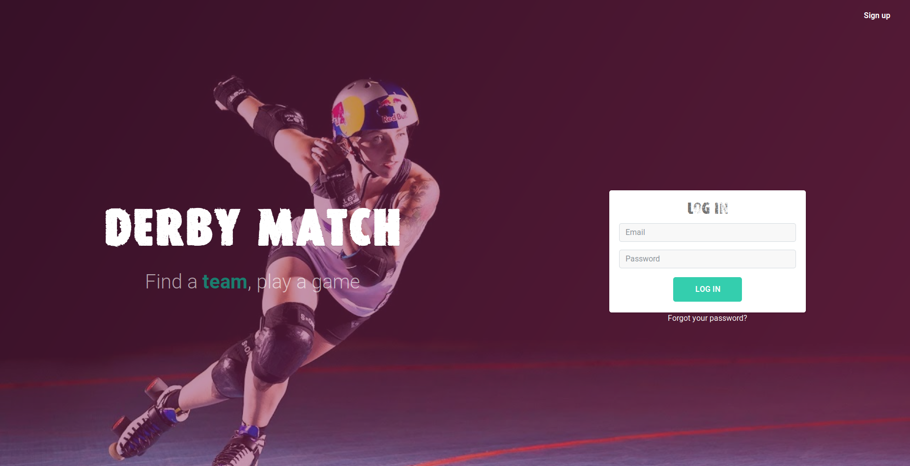

# DERBY MATCH

Rails app generated with [lewagon/rails-templates](https://github.com/lewagon/rails-templates), created by the [Le Wagon coding bootcamp](https://www.lewagon.com) team.

Derby match is a website developed from sratch in two weeks by 4 wannabe dev. It helps roller derby teams to find other teams to play against and to plan games.

[See video (french)](https://youtu.be/HZ87deV1-pY?t=4426)

## Tech
**Back-end**: Ruby on rails.

**Front-end**: HTML/CSS/JS, Bootstrap 4, Figma.

**Devops**: Git, Github, PostGreSQL, Cloudinary.

